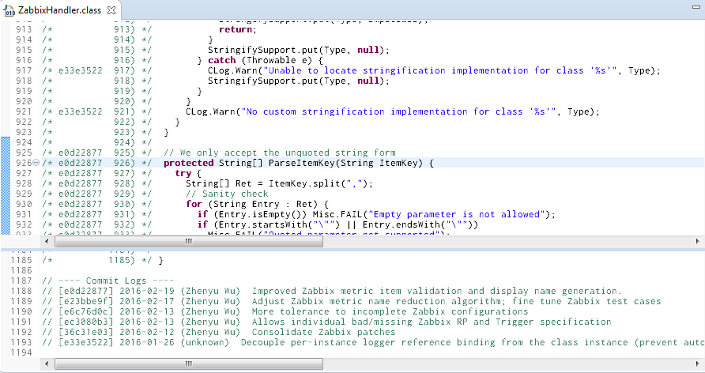

# Bless
Automated change-annotated source code generator

## "Why the (#$^% did he/she/I/whoever write this line?"
I often find myself wondering when stepping throw a piece of buggy code.

Well, this utility intends to ease the pain a little bit, by providing annotated source code based on Git commit history.

## What it does:
For each version managed, non-binary file, generate a change-annotated version of the content
* Each original line now bares a tag on the left, if any change happened between a specific commit to the current
  * When tag = commit hash, this is essentially the git-blame feature.
* In addition, at the end of each file, a commit log is appended describing all and only commits that happened in this file
  *  The description includes commit hash, date, commiter name, and commit message, ordered in reverse date.
  *  This is essentially a git-log feature.
* Optionally, you may opt to customize the tag by adding an additional index along side with the commit hash.
  *  All indics should have a common prefix, and put as the first word in the commit message
  *  The order of commit log at the end of each file is also costomizable, following gnu sort semantics

### Screenshot



## How to use
This is a commandline utility, designed to be invoked with current path in a Git repository.

### Requirement
Currently only UNIX-like system is supported.

Required supporting utilities:
* bash version 4+
* git
* sed
* cut
* unix2dos
* tar

### Syntax
```
<path/to/>Bless.sh [index-prefix] [revision-from] [sort-field]
```

All parameters are optional.
* **index-prefix**: when specified, the first word of each commit message is examined, if prefix matches, the content is used along side with the commit hash as tag to annotate changes.
  * *Default behavior: only use commit hash as tag*
* **revision-from**: when specified, only changes in revisions later than provided will be considered;
  * *Default behavior: track changes from the last annotated Git tag*
* **sort-field**: when specified, sort commit log message in specified order. (Syntax refer to gnu sort manual, KEYDEF)
  * *Default behavior: "2r" -- sort the second field (date) in reverse order*

### Generated Content
Normally, the script will produce a file named "<original-name>.blessed", with change-annotated content.

Because this content is *NOT* the original content, therefore most likely, the file is no longer suitable for the original processing it was designed to go through (e.g. compilation, interpretation, etc.). The extension change reflects this fact.

However, for certain specific type of files, whose content has well-defined "block-comment" syntax, it is possible to produce change-annotated source that preserves the original source semantics, and thus the original processing. For example, currently this utility recognizes Java/C/C++ sources by file extension, and apply special processing to generate compilable change-annotated sources. For those sources, the original file name is preserved.

### Output Files
* A directory "build/blessed" will be created
  * All change-annotated source files will reside inside this directory
  * It can be part of a bigger build process, so that some later procedure can cherry-pick the generated sources
* A file "build/.bless.config" will be created
  * It records the last run configuration, in order to optimize future runs
    * If the next execution of this script has matching configuration, only changed files will be re-processed
    * If this file is deleted, the next execution of this script will re-process all files from scratch
* A file "build/Source.Blessed.tgz" will be created
  * It contained tar-gzipped content of the "build/blessed" directory
  * This package is suitable to be part of a whole project archiving

# License
BSD 3-clause New License
